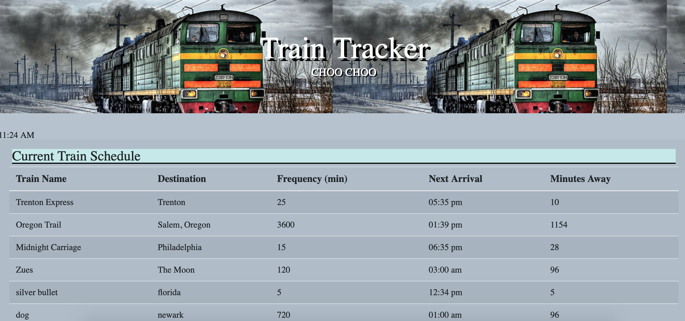
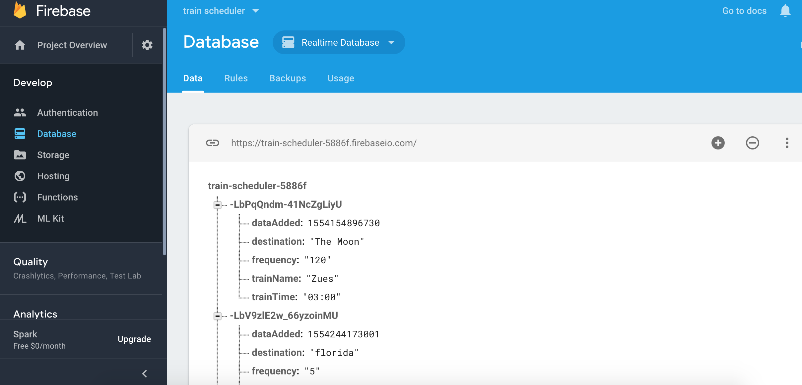

# Train-Scheduler

## Description

* When adding trains, administrators should be able to submit the following:

      _Train Name_

      _Destination_

      _First Train Time -- in military time_

      _Frequency -- in minutes_

* This app will calculate when the next train will arrive; this should be relative to the current time.

* Users from many different machines must be able to view same train times.

### Built With

* Firebase API

